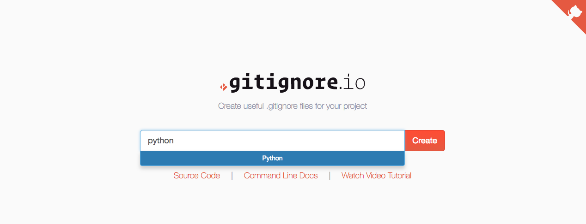
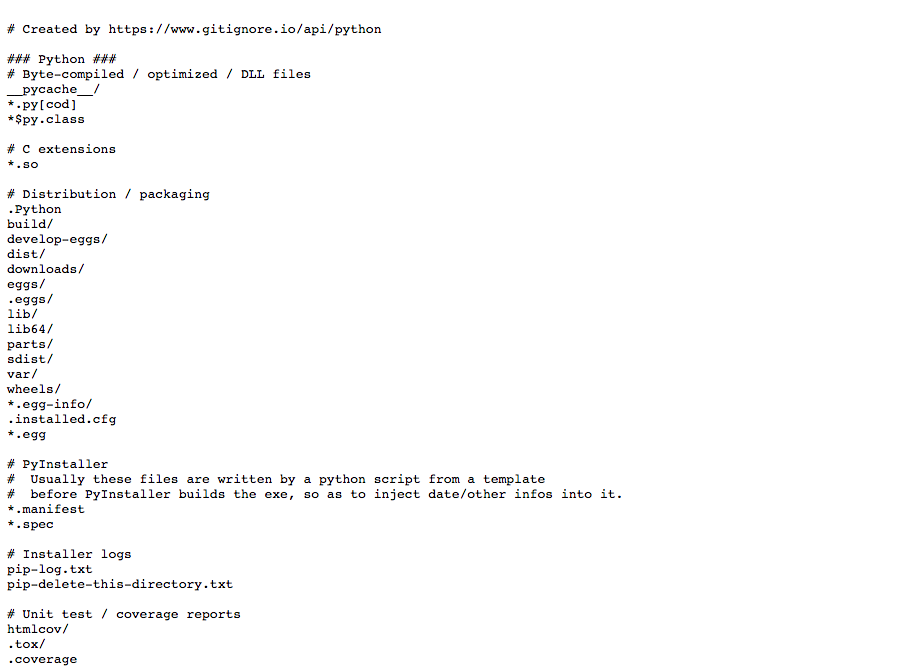

`git`을 사용하여 버전관리를 할 때 포함시켜야하는 파일들과 포함되면 안되는 파일들이 존재한다. 이번 포스트에서는 버전관리에 포함시키지 말아야 하는 파일을 `git`에서 어떻게 처리하는지, 그리고 이미 원격 저장소에 올린 파일을 제외시키는 방법에 대해 정리하였다.

<br>

## .gitignore

버전관리에서 제외시킬 파일은 `.gitignore` 파일을 생성하여 관리한다. 프로젝트에 필요한 비밀정보 및 개인정보로 구성된 json 형태의 파일이나 `.DS_Store`, `pyenv` 관련 파일들을 적어두는 것이다.

- `.gitignore`은 프로젝트 생성 초기에 만들어주는 것이 좋다.
- `.gitignore` 파일을 생성한 후 에디터로 열어 커밋하지 않을 파일 확장자를 추가한다.
- 또는 git이 무시할 파일의 패턴을 등록하여 `git add` 또는 `git commit` 명령어에서 제외되도록 한다.
	- `[oa]` : 대괄호 안에 있는 문자를 확장자로 쓰는 파일들은 무시된다. 예를 들어, `o`와 `a`가 포함된 파일은 git에 올라가지 않는다.
	- `*.swp` : 파일이름에 상관없이 `.swp`를 확장자로 가지는 파일을 모두 제외시켜준다.

```txt
# .gitignore
# 추가할 확장자명

 #################
 #compiled source#
 *.a
 *.o
 *.so

 ############
 # packages #
 *.dmg
 *.iso
 *.tar
 *.swp

 ######################
 # OS generated files #
 .DS_Store*
```

<br>

- 작성완료 후에는 `.gitignore`파일을 버전컨트롤 관리시스템에 등록해준다.

```powershell
$ git add .
$ git commit -m "add ignore file config"
```

<br>

## 버전컨트롤이 되고 있는 파일 제외시키기

원격저장소에 올라간 파일은 이미 버전 컨트롤이 시작된 파일이다.(즉, commit된 파일이다.) 만약 제외시킬 파일을 실수로 버전관리에 추가했거나 나중에 제외시킬 필요가 생겼을 경우에는 `.gitignore`에 해당 파일이 제외되도록 추가히주는 것 뿐만 아니라 이미 올라간 기록을 지워주는 작업이 필요하다.

예를 들어 `.DS_Store` 파일을 실수로 `add` 또는 `commit`했을 경우에는 다음과 같이 제외해준다.

```powershell
$ git rm --dry-run *.DS_Store
```

<br>

## 이미 파일이 원격저장소에 `push`된 경우

이미 원격저장소에 푸시를 했다면 문제는 좀더 복잡해진다. 이럴 때는 레포지토리를 클론하여 다음과 같은 과정을 진행해준다.

```powershell
# 제외시킬 파일을 이름으로 찾아 기록에서 삭제한다.
find . -name ".DS_Store" -exec git rm --cached -f {} \;.

# 삭제한 과정을 커밋해준다.
git commit -m "delete files"

# 해당 커밋을 푸시해준다.
git push
```

해당 파일을 깃 레포지토리에서 지우면서 로컬에서만 관리하고 싶은 경우에  위와 같이 처리해준다.
`.gitignore`는 `.DS_Store`가 인덱스에서 먼저 제거된 경우에만 작동하므로 `git rm --cached -f` 명령어를 사용하였다.

<br>

---

## 마치며

버전관리에 등록될 파일과 그렇지 않은 파일을 관리해주는 것은 보안 측면에서 매우 중요하다. 되도록이면 프로젝트 초기 설계단계에서 작성하여 실수로 기록을 남기는 일이 없도록 하자.

만약 어떤 파일을 제외시켜야 할 지 모르겠다면 사용하고 있는 언어와 프레임워크, OS 별로 원격저장소에서 제외시킬 파일 확장자를 관리해주는 API 사이트(https://www.gitignore.io/)를 사용하는 것도 좋은 방법이다.



<br>

접속하여 검색창에서 사용하는 언어를 입력하면 다음과 같이 해당 언어에 대해 생성되는 파일 중 버전관리에서 제외할 확장자들을 텍스트로 제공해준다.




<br>
