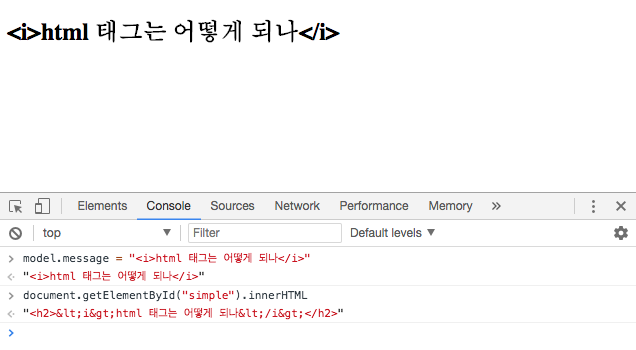
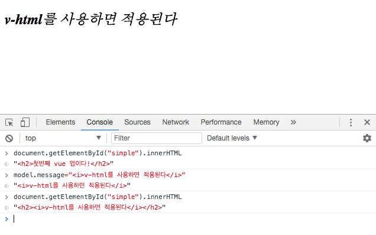
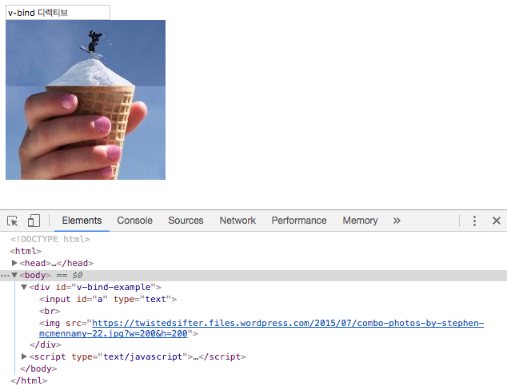
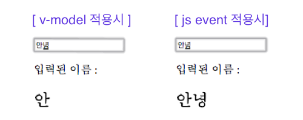
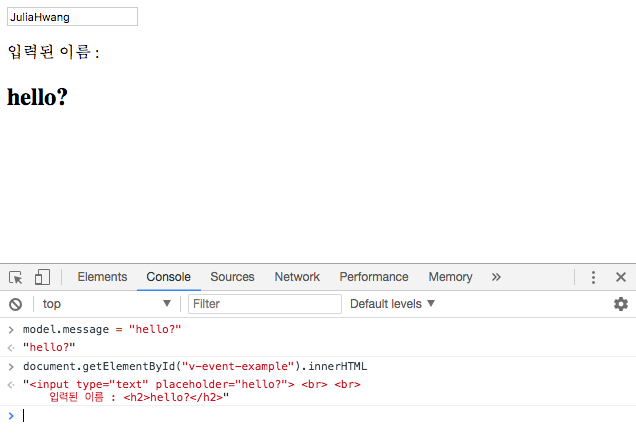
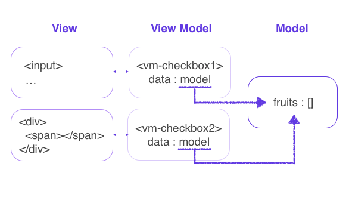

이번 포스트에서는 템플릿 표현식(

```
 {{}} 
```

) 말고도 선언적 렌더링을 위해 HTML 요소 내부에서 사용할 수 있는 `디렉티브`(directive)에 대해 알아보고자 한다.

<br>

## `v-text`와 `v-html`

기존에 템플릿 표현식으로 데이터를 삽입했다. 그렇지만 `Vue.js`에서는 HTML 요소에 목적에 따라 다양한 디렉티브를 사용할 수 있다.

```html
<div id="simple">
  {{ message }}

  <!--위와 같은 효과.-->
  <h2 v-text="message"></h2>
</div>
```

위의 코드로 변경한 후에도 브라우저에서는 템플릿 표현식을 사용한 것과 동일하게 보인다. 하지만 모델 객체의 `message` 속성값을 태그가 있는 것으로 바꿔보면 변경시 추가해준 태그는 다음과 같이 적용되지 않는 모습을 보여준다.



`v-text` 디렉티브가 `innerText` 속성에 연결되어 태그문자열을 인코딩하기 때문에 화면에 태그를 그대로 출력하기 때문이다.

<br>

또 `v-html` 디렉티브를 사용하여 같은 페이지를 렌더할 수 있다.

```html
<div id="simple">
  <h2 v-html="message"></h2>
</div>
```

`v-html` 디렉티브는 태그를 파싱하여 화면에 태그가 적용된 모습을 보여준다.



그 이유는 `innerHTML` 속성과 연결되어 HTML의 인코딩, 디코딩을 수행하지 않기 때문이다.

하지만 `v-html` 디렉티브는 `<script>` 태그를 그대로 바인딩하므로 사이트 간 스크립팅 공격(XSS)에 취약하다. 따라서 `v-text`를 사용하도록 한다.

<br>

## `v-bind`

`v-bind`는 요소 객체의 속성(즉, 데이터)들을 바인딩하기 위해 사용한다.

```html
<body>
  <div id="v-bind-example">
    <input id='a' type="text" v-bind:value="message">
    <br />
    
  </div>
```

```js  
  <script type="text/javascript">
    var model = {
      message : 'v-bind 디렉티브',
      imagePath : "https://twistedsifter.files.wordpress.com/2015/07/combo-photos-by-stephen-mcmennamy-22.jpg?w=200&h=200"
    };

    var bind = new Vue({
      el : '#v-bind-example',
      data : model
    })
  </script>
```

위의 코드에서와 같이 HTML 요소의 속성이 모델의 데이터로 변경되었다.

개발자도구에서는 다음과 같이 렌더링된다.



<br>

## `v-model`

지금까지 본 디렉티브들은 단방향으로만 데이터가 바인딩되었다. 즉, 브라우저에서 HTML 요소에 직접 값을 변경해도 모델 객체의 값은 변경되지 않는다.

이를 양방향으로 동작하도록 해주는 것이 `v-model` 디렉티브이다.

`v-bind` 디렉티브는 단방향 데이터바인딩을 통해 기존 데이터를 렌더하는 역할을 하고 `v-model` 디렉티브는 사용자가 입력한 값을 양방향 데이터바인딩으로 모델의 속성에 업데이트해주는 역할을 하기 때문이다.

<br>

### (1) 텍스트 박스에 v-model 적용하기

따라서 `v-model` 디렉티브를 설정할 때 input 태그 안에 보여질 기본 텍스트를 넣어주고 싶다면 `placeholder`에 `v-bind`를 적용시켜주면 된다.


브라우저 콘솔에서 직접 `name` 값을 변경해보면 실제로 입력한 데이터가 바인딩되어있는 것을 확인할 수 있다.  

<br>

`v-model` 디렉티브를 사용했을 때 아쉬운 점은 영어를 제외한 언어 입력시 마지막 글자가 표시되지 않는다는 점이다.



<br>

이 경우에는 자바스크립트 이벤트로 글자를 입력할 때마다 `v-model`이 데이터바인딩을 할 수 있도록 해주었다.



<br>


### (2) 입력 폼 필드에 v-model 적용하기

`v-model` 디렉티브를 사용하면 체크박스 타입의 input 태그와 같이 여러 개의 값을 양방향 바인딩할 때도 유용하다.


스크립트의 코드를 보면 사용자가 체크하는 값을 뷰모델 객체를 통해 model 객체의 fruits 배열에 들어있는 값을 즉시 변경해준다.

```html
<div id="vm-checkbox1">
  <div>좋아하는 과일을 모두 골라주세요 : </div>
  <br />
  <input type="checkbox" value="사과" v-model="fruits">사과.
  <input type="checkbox" value="포도" v-model="fruits">포도.
  <input type="checkbox" value="키위" v-model="fruits">키위
  <!--...-->
</div>
<hr />
<div id="vm-checkbox2">
    선택한 과일들 : <span v-text="fruits"></span>
</div>
```

```js
<script type="text/javascript">
    var model = {
        fruits : []
    };

    var vmodel1 = new Vue({
      el : '#vm-checkbox1',
      data : model
    })
    var vmodel2 = new Vue({
      el : '#vm-checkbox2',
      data : model
    })
</script>
```

다음의 그림처럼 사용자가 데이터(model)를 입력할 때 배열에 추가된 값이 `vm-checkbox2`에도 연결되어 있기 때문에 체크한 즉시 `v-model` 디렉티브에 의해 변경된 데이터가 화면에 렌더링 된다.



<br>

---

## 마치며

다음 포스트에서는 `v-show`, `v-if` 등 이번 포스트에 이어 디렉티브들을 계속 소개할 것이다.


해당 포스트는 웹에서 얻은 참고 자료들과 원형섭님의 [Vue.js Quick Start] 도서를 바탕으로 공부한 내용을 요약, 정리하였다.

<br>
